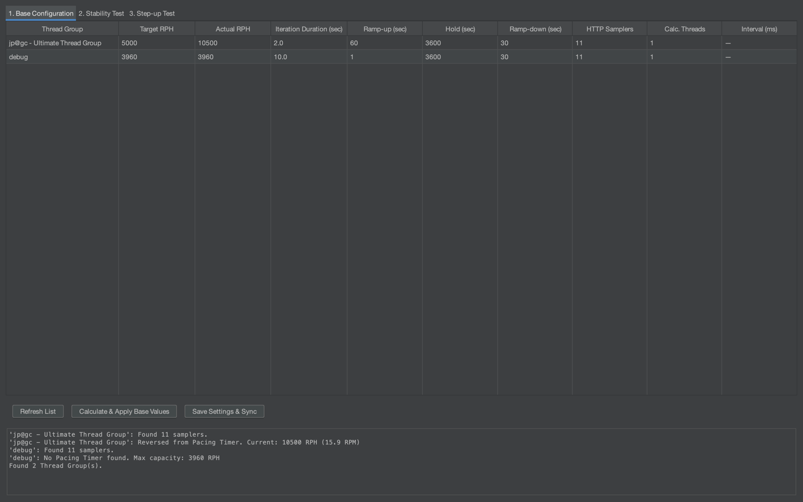
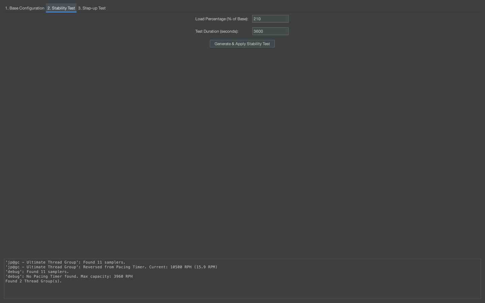
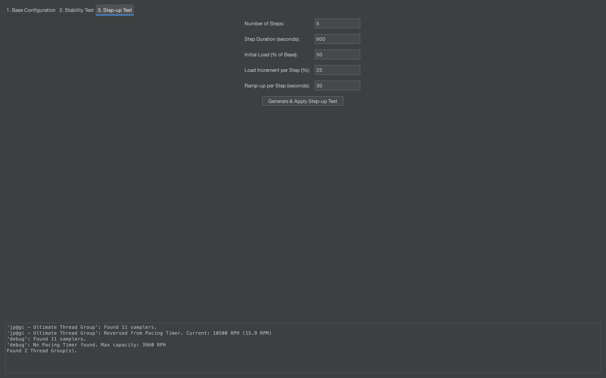

# JMeter RPH Calculator Plugin

Этот плагин избавляет от необходимости вручную высчитывать количество потоков и параметры таймеров. Вы задаете целевой RPH (запросов в час) и длительность скрипта, а плагин сам настраивает Thread Group и Pacing.

### Зачем это нужно?
В JMeter сложно сходу настроить точную интенсивность, если ваш сценарий длинный или содержит много запросов. Плагин автоматизирует расчет по формуле:
`Threads = (Target RPH * Iteration Duration) / (3600 * Sampler Count)`

### Основные фишки
* **Автоматический подсчет сэмплеров**: Плагин сам прочесывает Thread Group и видит, сколько в ней HTTP-запросов (даже внутри контроллеров), чтобы правильно рассчитать нагрузку.
* **Поддержка Ultimate Thread Group**: Умеет работать как со стандартными группами, так и с плагином `jp@gc - Ultimate Thread Group`.
* **Две колонки RPH**:
    * **Target RPH** — нужная интенсивность в час (сохраняется в JMX).
    * **Actual RPH** — актуальная интенсивность для тред группы после настроек теста надежности или поиска максимума (для отладки или тестов на 50/80% мощности).
* **Генераторы тестов**: 
    * Кнопка для создания **Stability Test** (на заданный % от цели). Пример: тест стабильности проводится на 210% от профиля нагрузки, указываете это значение в процентах и длительность теста, плагин расчитает количество тредов и пейсинг автоматически.
    * Кнопка для создания **Step-up Test** (ступенчатый график для поиска максимума). Можно указать стартовую нагрузку в процентах, количество ступеней, нагрузку для ступени. Стандартный поиск максимума.
* **Сохранение настроек**: Все параметры (Target RPH и длительность итерации) сохраняются прямо в вашем `.jmx` файле в элементе **User Defined Variables**, так что при следующем открытии теста ничего вводить заново не нужно.

### Как пользоваться
1. Установите JAR в `lib/ext` и перезапустите JMeter.
2. Откройте плагин через меню (раздел "Tools" -> "RPH Calculator for Ultimate thread group").
3. Нажмите **Refresh List**, чтобы подтянуть текущие группы из теста.
4. Введите **Target RPH** и **Iteration Duration** (время прохождения всего сценария одним пользователем в секундах).
5. Нажмите **Calculate & Apply Base Values**. 
    * Плагин создаст внутри каждой группы `Pacing Action` с таймером.
    * Количество потоков обновится автоматически.
6. Сохраните тест-план.

### Кнопки
* **Refresh List**: Синхронизирует таблицу плагина с реальным деревом JMeter.
* **Calculate & Apply**: Делает расчет и физически меняет количество потоков и таймеры в тесте.
* **Save Settings & Sync**: Просто сохраняет ваши "хотелки" (Target RPH и т.д.) в переменные и обновляет Ramp-up/Hold, не меняя при этом текущее количество потоков.

### Важные нюансы
* Плагин использует **Shared Mode** в Pacing Timer (режим 4). Это значит, что все потоки внутри группы работают как одна команда, деля общую цель по RPH.
* Если вы вручную поменяли что-то в JMeter, всегда жмите **Refresh List** в плагине, чтобы синхронизировать значения.
* Для корректного рассчета рекомендую сначала прогнать сценарий через Transaction controller и посмотреть длительность, если значение 10 сек, смело накидывайте 5 секунд и вносите значение 15 в iteration duration.
