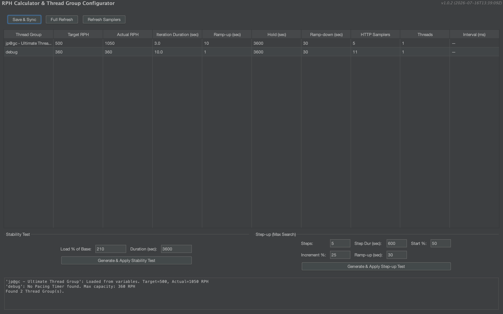

# JMeter RPH Calculator Plugin

Этот плагин избавляет от необходимости вручную высчитывать количество потоков и параметры таймеров. Вы задаете целевой RPH (запросов в час) и длительность скрипта, а плагин сам настраивает Thread Group и Pacing.  

Выставляете: 
-target rph (например 1050)  
-iteration duration (общее время выполнения всех сэмплеров в тред группе, например 3 секунды)  
-ramp-up (время, за которое поднимутся все треды)  
-hold (длительность нагрузки(теста))  
-ramp-down (время завершения работы тредов)  
-HTTP Samplers (количество сэмплеров в тред группе, сканируется автоматически, но можно указать вручную)  
-Threads (количество тредов, выставляется автоматически, но можно менять вручную)  

Формула:  
actual rph / 60 / samplers = target throughput  
1050/60/11 = 1,59090909 -> это значение устанавливается в constant throughput timer, который внутри flow control action  

После расчета автоматически добавляется flow control action внутри которого constant throughput timer, а так же User Defined Variables, в котором сохраняются значения из таблицы

---

